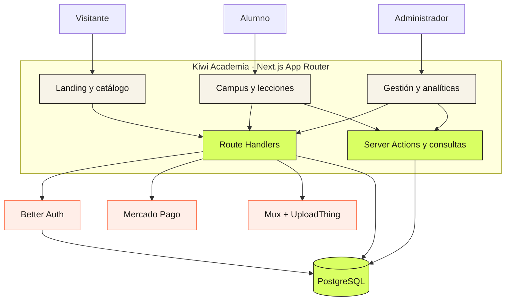
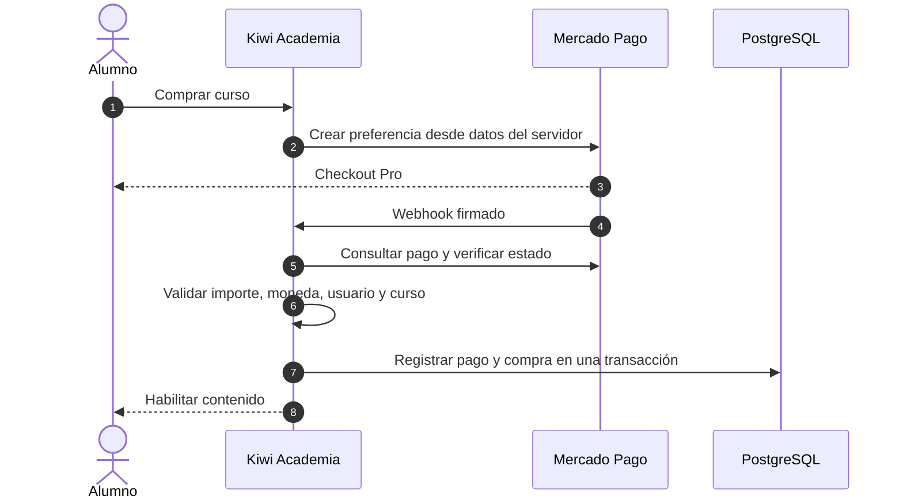
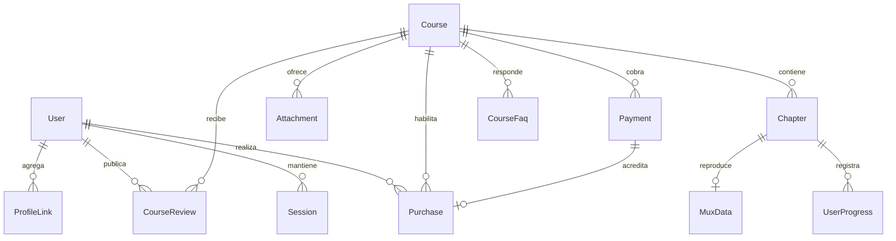

<p align="center">
  
</p>

<h1 align="center">Kiwi Academia 🥝</h1>

<p align="center">
  <strong>La infraestructura completa para publicar, vender y cursar formaciones online.</strong>
  <br />
  Un LMS full stack en español, construido con Next.js, PostgreSQL, Better Auth, Mercado Pago, Mux y UploadThing.
</p>

<p align="center">
  <a href="#-producto">Producto</a> ·
  <a href="#-funcionalidades">Funcionalidades</a> ·
  <a href="#-inicio-rápido">Inicio rápido</a> ·
  <a href="#-arquitectura">Arquitectura</a> ·
  <a href="#-configuración">Configuración</a> ·
  <a href="#-origen-y-créditos">Créditos</a>
</p>

<p align="center">
  
  
  
  
  
  
</p>

---

## ✦ Producto

Kiwi Academia cubre el recorrido entero de una academia digital: una persona descubre un curso, crea su cuenta, paga, aprende, registra su avance y participa en la comunidad. El equipo administra contenido, video, archivos, ventas e integraciones desde la misma aplicación.

<table>
  <tr>
    <td width="33%" valign="top">
      <h3>⚡ Vendé</h3>
      <p>Catálogo comercial, páginas de curso y Checkout Pro con acreditación segura por webhook.</p>
    </td>
    <td width="33%" valign="top">
      <h3>◉ Enseñá</h3>
      <p>Cursos, capítulos, video, adjuntos, progreso y una experiencia de aprendizaje protegida.</p>
    </td>
    <td width="33%" valign="top">
      <h3>↗ Construí comunidad</h3>
      <p>Perfiles públicos, opiniones y ranking calculado a partir de actividad real.</p>
    </td>
  </tr>
</table>

> [!NOTE]
> Kiwi Academia es una evolución open source de [next13-lms-platform](https://github.com/AntonioErdeljac/next13-lms-platform), el proyecto educativo de [Code With Antonio](https://www.youtube.com/watch?v=Big_aFLmekI). La base original fue transformada con nueva marca, producto, autenticación, pagos, datos y comunidad.

## ◫ Un producto, tres experiencias

| Superficie | Para quién | Recorrido |
| --- | --- | --- |
| **Sitio público** | Visitantes | Descubrir, comparar, previsualizar y comprar cursos |
| **Campus** | Alumnos | Retomar clases, descargar materiales y completar el recorrido |
| **Administración** | Equipo autorizado | Crear contenido, publicar, conectar cobros y revisar ventas |

## ✓ Funcionalidades

### Catálogo y conversión

- Landing de Kiwi Academia y catálogo de cursos publicados.
- Búsqueda con filtros y sugerencias ordenadas por relevancia.
- Página comercial con programa, nivel, duración, audiencia y requisitos.
- Objetivos, proyecto final, preguntas frecuentes y opiniones verificadas.
- Trailer y previsualización de lecciones gratuitas con Mux.
- Compra con Mercado Pago y estados claros de aprobación, demora o rechazo.
- Contacto directo por WhatsApp cuando está configurado.
- Metadata, Open Graph, sitemap y reglas de indexación.

### Aprendizaje

- Registro, ingreso, cierre de sesión y recuperación de acceso.
- Dashboard con cursos activos, completados y próxima lección.
- Progreso persistente por capítulo y por curso.
- Contenido pago protegido por compra acreditada.
- Reproductor HLS con Mux y materiales descargables.
- Lecciones gratuitas disponibles como muestra.
- Perfil editable con avatar, bio, ubicación y enlaces.
- Ranking de comunidad basado en compras y progreso válidos.

### Autoría y operación

- Creación, edición, publicación y despublicación de cursos.
- Capítulos reordenables mediante drag and drop.
- Editor enriquecido para contenido formativo.
- Portadas y adjuntos gestionados con UploadThing.
- Ingesta, procesamiento y reproducción de video con Mux.
- Precio, nivel, duración, resultados, audiencia, FAQ y proyecto final.
- Validación de requisitos antes de publicar.
- Analíticas basadas únicamente en pagos aprobados.

### Pagos y seguridad

- Mercado Pago Checkout Pro en pesos argentinos.
- Conexión OAuth con Authorization Code y PKCE.
- Access Token y Refresh Token cifrados en PostgreSQL.
- Renovación automática de credenciales próximas a vencer.
- Webhook firmado y verificación del pago contra Mercado Pago.
- Controles de importe, moneda, usuario, curso y estado de publicación.
- Idempotencia: un evento repetido no duplica la compra.
- Importes monetarios almacenados como `Decimal`.
- Permisos administrativos comprobados en servidor.
- Sesiones persistidas con Better Auth.

## ↺ De tutorial a producto

| Área | Proyecto original | Kiwi Academia |
| --- | --- | --- |
| Framework | Next.js 13 | Next.js 15 con App Router |
| Identidad | Tutorial LMS | Producto propio en español |
| Autenticación | Clerk | Better Auth sobre PostgreSQL |
| Datos | MySQL / PlanetScale | PostgreSQL / Prisma |
| Pagos | Stripe | Mercado Pago Checkout Pro |
| Gestión | Teacher mode | Administración protegida |
| Catálogo | Búsqueda y filtros | Venta, trailer, FAQ, reseñas y recomendaciones |
| Alumno | Dashboard y progreso | Campus, continuidad, perfil y ranking |

## 🚀 Inicio rápido

### Requisitos

- Node.js 20 LTS o superior.
- npm.
- PostgreSQL.
- Credenciales de las integraciones que quieras activar.

### 1. Instalar

```bash
git clone https://github.com/0xventure-s/panteraplatform.git
cd panteraplatform
npm install
```

La instalación genera Prisma Client mediante `postinstall`.

### 2. Crear el entorno

Crea `.env` en la raíz y completa, como mínimo:

```dotenv
NEXT_PUBLIC_APP_URL="http://localhost:3000"
DATABASE_URL="postgresql://..."
BETTER_AUTH_URL="http://localhost:3000"
BETTER_AUTH_SECRET="una-clave-aleatoria-de-32-caracteres-o-más"
```

La guía de proveedores, seguridad y variables está en [CONFIGURACION_ENV.md](./CONFIGURACION_ENV.md).

### 3. Preparar PostgreSQL

```bash
npx prisma generate
npx prisma migrate deploy
```

El catálogo inicial es opcional:

```bash
npm run seed
```

> [!WARNING]
> El seed crea una cuenta administrativa, categorías, cursos y capítulos. Revisa `scripts/seed.mjs`, define `SEED_ADMIN_PASSWORD` con al menos ocho caracteres y confirma la base de destino antes de ejecutarlo.

### 4. Iniciar

```bash
npm run dev
```

Abre [http://localhost:3000](http://localhost:3000).

## ◇ Arquitectura



### Acreditación de una compra



### Modelo principal



## ⬡ Stack

| Capa | Tecnología | Responsabilidad |
| --- | --- | --- |
| Aplicación | Next.js 15, React 18, TypeScript | Render, navegación, servidor y API |
| Interfaz | Tailwind CSS, Radix UI, shadcn, Lucide | Sistema visual y componentes accesibles |
| Formularios | React Hook Form, Zod | Estado y validación |
| Datos | PostgreSQL, Prisma ORM | Persistencia, relaciones y transacciones |
| Identidad | Better Auth | Cuentas, contraseñas y sesiones |
| Comercio | Mercado Pago | OAuth, checkout y webhooks |
| Video | Mux Video, Mux Player | Procesamiento y streaming HLS |
| Archivos | UploadThing | Portadas, adjuntos y avatares |
| Correo | Resend | Recuperación de acceso |
| Visualización | Recharts | Analíticas administrativas |
| Estado cliente | Zustand | Estado UI compartido |

## ⚙ Configuración

<details>
<summary><strong>Variables disponibles</strong></summary>

```dotenv
# Aplicación
NEXT_PUBLIC_APP_URL="http://localhost:3000"
NEXT_PUBLIC_SITE_NAME="Kiwi Hub"
NEXT_PUBLIC_SITE_DESCRIPTION="Transformación digital para pymes y empresas con sistemas de turnos, comandas y agentes de inteligencia artificial."
NEXT_PUBLIC_WHATSAPP_NUMBER=""
NEXT_PUBLIC_WHATSAPP_MESSAGE=""

# Base de datos y autenticación
DATABASE_URL=""
BETTER_AUTH_URL="http://localhost:3000"
BETTER_AUTH_SECRET=""
ADMIN_EMAIL=""
ADMIN_USER_ID=""

# Recuperación de acceso
RESEND_API_KEY=""
AUTH_EMAIL_FROM=""

# Mercado Pago
MERCADOPAGO_CLIENT_ID=""
MERCADOPAGO_CLIENT_SECRET=""
MERCADOPAGO_REDIRECT_URI=""
MERCADOPAGO_WEBHOOK_SECRET=""
INTEGRATION_ENCRYPTION_KEY=""

# Archivos y video
UPLOADTHING_SECRET=""
UPLOADTHING_APP_ID=""
MUX_TOKEN_ID=""
MUX_TOKEN_SECRET=""

# Datos iniciales
SEED_ADMIN_PASSWORD=""
```

</details>

> [!IMPORTANT]
> `.env` está excluido de Git. Nunca publiques credenciales, tokens, contraseñas ni cadenas de conexión. Todo valor con prefijo `NEXT_PUBLIC_` queda disponible en el navegador.

### Disponibilidad por integración

| Integración | Sin credenciales | Con credenciales |
| --- | --- | --- |
| PostgreSQL | La aplicación no puede iniciar | Datos, sesiones y progreso persistentes |
| Mercado Pago | No se pueden crear cobros | Checkout, webhook y acreditación |
| Mux | No se procesan videos nuevos | Ingesta y reproducción HLS |
| UploadThing | No funcionan las cargas | Portadas, adjuntos y avatares |
| Resend | No se entrega la recuperación | Correo de restablecimiento |
| WhatsApp | El acceso se oculta | Contacto directo visible |

## 🔐 Acceso y permisos

| Capacidad | Visitante | Alumno | Administrador |
| --- | :---: | :---: | :---: |
| Recorrer catálogo | ✓ | ✓ | ✓ |
| Ver lecciones gratuitas | ✓ | ✓ | ✓ |
| Comprar un curso | — | ✓ | ✓ |
| Consumir contenido adquirido | — | ✓ | ✓ |
| Registrar progreso y opinar | — | ✓ | ✓ |
| Editar cursos y capítulos | — | — | ✓ |
| Publicar y revisar analíticas | — | — | ✓ |
| Conectar Mercado Pago | — | — | ✓ |

La autorización administrativa se resuelve en servidor mediante rol persistido, `ADMIN_EMAIL` o `ADMIN_USER_ID`. Ocultar un botón nunca reemplaza esa comprobación.

## 🗂 Estructura

```text
app/
├── (marketing)/     Landing, catálogo, cursos y resultado de pago
├── (auth)/          Registro, ingreso y recuperación
├── (dashboard)/     Campus, perfil, ranking y administración
├── (course)/        Reproductor, capítulos y progreso
└── api/             Auth, contenido, uploads, pagos y webhooks

actions/             Consultas y operaciones de servidor
components/          Componentes compartidos y primitivas UI
hooks/               Hooks reutilizables
lib/                 Auth, datos, correo, pagos y comunidad
prisma/              Esquema y migraciones PostgreSQL
public/              Marca, banners, portadas y avatares
scripts/             Carga de datos iniciales
```

## ⌘ Comandos

| Comando | Resultado |
| --- | --- |
| `npm run dev` | Inicia el entorno local |
| `npm run typecheck` | Comprueba TypeScript sin emitir archivos |
| `npm run lint` | Ejecuta ESLint |
| `npm run build` | Genera la compilación de producción |
| `npm start` | Sirve la compilación generada |
| `npm run seed` | Carga la cuenta y el catálogo inicial |
| `npx prisma generate` | Regenera Prisma Client |
| `npx prisma migrate deploy` | Aplica migraciones pendientes |

### Compilar para producción

```bash
npm run typecheck
npm run lint
npm run build
npm start
```

No hay un runner de pruebas automatizadas configurado. Antes de publicar, verifica manualmente registro, permisos, compra, webhook, acceso al curso, progreso, archivos y video.

## ↗ Rutas principales

| Ruta | Acceso | Destino |
| --- | --- | --- |
| `/` | Público | Portada |
| `/cursos` | Público | Catálogo |
| `/cursos/[courseId]` | Público | Detalle, trailer y compra |
| `/sign-in` | Público | Ingreso |
| `/sign-up` | Público | Registro |
| `/dashboard` | Sesión | Resumen del alumno |
| `/mis-cursos` | Sesión | Cursos y progreso |
| `/ranking` | Sesión | Comunidad |
| `/perfil` | Sesión | Perfil personal |
| `/admin/cursos` | Admin | Gestión de contenido |
| `/admin/integraciones` | Admin | Mercado Pago |
| `/admin/analiticas` | Admin | Ventas e inscripciones |

## ◎ Salida a producción

- [ ] Aplicar migraciones sobre la base correcta.
- [ ] Definir la cuenta administradora.
- [ ] Configurar dominio y secretos de Better Auth.
- [ ] Verificar el remitente de Resend.
- [ ] Registrar redirect URI y webhook de Mercado Pago.
- [ ] Probar pagos aprobados, pendientes, rechazados y repetidos.
- [ ] Validar cargas y reproducción con Mux y UploadThing.
- [ ] Confirmar HTTPS, metadata, sitemap y robots.
- [ ] Probar los recorridos de visitante, alumno y administrador.
- [ ] Confirmar la licencia de cada recurso visual de terceros.

## 🤝 Contribuir

1. Crea una rama desde el estado actualizado del repositorio.
2. Mantén el cambio enfocado y el copy en español natural.
3. Ejecuta `npm run typecheck` y `npm run lint`.
4. Verifica manualmente el recorrido afectado.
5. Abre un pull request con comportamiento, configuración y cambios de esquema.

Incluye capturas para cambios visuales. Nunca subas `.env`, secretos ni información real de usuarios.

## ♡ Origen y créditos

Kiwi Academia está forkeado y profundamente adaptado a partir de [AntonioErdeljac/next13-lms-platform](https://github.com/AntonioErdeljac/next13-lms-platform), creado por [Antonio Erdeljac / Code With Antonio](https://www.youtube.com/@codewithantonio). Su [curso original](https://www.youtube.com/watch?v=Big_aFLmekI) ofrece la base educativa sobre la que comenzó este proyecto.

La identidad Kiwi Academia, Better Auth, PostgreSQL, Mercado Pago, la experiencia comercial, los perfiles, las opiniones, el ranking y las ampliaciones operativas corresponden a esta evolución.

## Licencia

Este proyecto se comparte con intención open source. El repositorio todavía no incluye un archivo `LICENSE`; hasta incorporarlo, no asumas permisos de uso, modificación o redistribución más allá de lo autorizado por sus respectivos autores. Los servicios, dependencias y recursos visuales de terceros conservan sus propias licencias y condiciones.

---

<p align="center">
  <strong>Aprender. Construir. Lanzar.</strong>
  <br />
  Kiwi Academia 🥝
</p>
