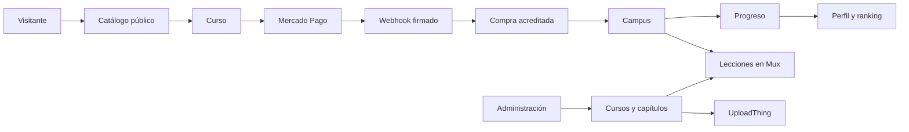

<p align="center">
  
</p>

<h1 align="center">🥝 Kiwi Academia</h1>

<p align="center">
  <strong>Una plataforma open source para crear, vender y cursar formaciones online.</strong>
  <br />
  Catálogo público, campus, progreso, comunidad, autoría de contenido y pagos con Mercado Pago en una sola aplicación.
</p>

<p align="center">
  
  
  
  
  
</p>

---

## Qué es Kiwi Academia

Kiwi Academia es un LMS full stack orientado a cursos de inteligencia artificial y construcción de productos. Reúne el recorrido completo de una academia digital: descubrimiento, registro, compra, aprendizaje, progreso, comunidad y administración del contenido.

El proyecto nace como un fork del LMS de [Code With Antonio](https://github.com/AntonioErdeljac/next13-lms-platform) y conserva esa base educativa como punto de partida. Desde entonces evolucionó hacia un producto propio en español, con nueva identidad, arquitectura de autenticación, base de datos PostgreSQL, cobros con Mercado Pago y superficies adicionales para comunidad, reputación y venta de cursos.

> [!NOTE]
> El repositorio original acompaña el curso [Build an LMS Platform](https://www.youtube.com/watch?v=Big_aFLmekI), publicado por Antonio Erdeljac en 2023. Los créditos de esa base pertenecen a su autor.

## Todo lo que incluye

### Experiencia pública

- Landing de Kiwi Academia y catálogo de cursos publicados.
- Búsqueda con filtros y sugerencias ordenadas por relevancia.
- Página comercial por curso con programa, objetivos, audiencia, requisitos y proyecto final.
- Trailer y previsualización de lecciones gratuitas mediante Mux.
- Preguntas frecuentes, valoraciones y opiniones de alumnos.
- Metadata, Open Graph, sitemap y reglas de indexación.
- Contacto directo por WhatsApp cuando el número está configurado.

### Campus del alumno

- Registro, ingreso, cierre de sesión y recuperación de contraseña.
- Panel personal con cursos en progreso y completados.
- Seguimiento persistente por capítulo y porcentaje de avance.
- Continuación desde la próxima lección disponible.
- Protección de contenido pago según la compra acreditada.
- Reproductor HLS con Mux y materiales descargables.
- Perfil público editable con avatar, presentación, ubicación y enlaces.
- Ranking de la comunidad basado en aprendizaje real.

### Gestión de cursos

- Alta, edición, publicación y despublicación de cursos.
- Capítulos ordenables con drag and drop.
- Editor enriquecido para descripciones.
- Portadas, adjuntos y archivos con UploadThing.
- Ingesta, procesamiento y reproducción de video con Mux.
- Precio, nivel, duración, resultados, audiencia, requisitos, FAQ y proyecto final.
- Estados de borrador/publicado y validaciones previas a la publicación.
- Analíticas construidas sobre ventas aprobadas.

### Comercio y seguridad

- Mercado Pago Checkout Pro en pesos argentinos.
- Conexión OAuth con Authorization Code y PKCE desde el panel de administración.
- Tokens de Mercado Pago cifrados en la base de datos.
- Renovación del acceso cuando las credenciales están por vencer.
- Webhook firmado, verificación server-to-server e idempotencia de pagos.
- Importes almacenados como `Decimal` para evitar errores de precisión.
- Autorización administrativa validada en servidor.
- Sesiones persistidas en PostgreSQL con Better Auth.

## De la base original a Kiwi

| Área | LMS original | Kiwi Academia |
| --- | --- | --- |
| Framework | Next.js 13 | Next.js 15 con App Router |
| Autenticación | Clerk | Better Auth con correo y contraseña |
| Base de datos | MySQL / PlanetScale | PostgreSQL / Prisma |
| Pagos | Stripe | Mercado Pago Checkout Pro |
| Administración | Teacher mode | Área de administración protegida |
| Catálogo | Búsqueda y filtros | Catálogo comercial, sugerencias, trailer, FAQ y reseñas |
| Alumno | Dashboard y progreso | Campus, continuidad, perfil y ranking |
| Producto | Tutorial LMS | Marca, contenido y experiencia en español |

## Arquitectura



```text
app/                 Rutas, layouts, páginas y handlers HTTP
├── (marketing)/     Landing, catálogo, cursos y resultados de pago
├── (auth)/          Acceso y recuperación de cuenta
├── (dashboard)/     Campus, perfil, ranking y administración
├── (course)/        Experiencia de aprendizaje por capítulo
└── api/             Auth, cursos, progreso, uploads, pagos y webhooks

actions/             Consultas y operaciones de servidor
components/          UI reutilizable y primitivas basadas en shadcn/Radix
hooks/               Hooks compartidos
lib/                 Auth, Prisma, correo, pagos, comunidad y configuración
prisma/              Esquema y migraciones de PostgreSQL
public/              Marca, banners, portadas, avatares e imágenes
scripts/             Seed de datos iniciales
```

## Stack

| Capa | Tecnología |
| --- | --- |
| Aplicación | Next.js 15, React 18, TypeScript |
| Interfaz | Tailwind CSS, Radix UI, shadcn, Lucide |
| Formularios | React Hook Form, Zod |
| Datos | PostgreSQL, Prisma ORM |
| Autenticación | Better Auth |
| Pagos | Mercado Pago Checkout Pro, OAuth PKCE, webhooks |
| Video | Mux Video y Mux Player |
| Archivos | UploadThing |
| Correo | Resend mediante API |
| Gráficos | Recharts |
| Estado cliente | Zustand |

## Puesta en marcha

### Requisitos

- Node.js 20 LTS o superior.
- npm.
- Una base PostgreSQL accesible.
- Credenciales de los servicios que quieras habilitar.

### 1. Clonar e instalar

```bash
git clone https://github.com/0xventure-s/kiwi-academia.git
cd kiwi-academia
npm install
```

`npm install` ejecuta `prisma generate` automáticamente mediante `postinstall`.

### 2. Configurar el entorno

Crea un archivo `.env` en la raíz. La referencia completa y las instrucciones de cada proveedor están en [CONFIGURACION_ENV.md](./CONFIGURACION_ENV.md).

<details>
<summary><strong>Ver variables disponibles</strong></summary>

```dotenv
# Aplicación
NEXT_PUBLIC_APP_URL="http://localhost:3000"
NEXT_PUBLIC_SITE_NAME="Kiwi Academia"
NEXT_PUBLIC_SITE_DESCRIPTION="Cursos de IA para construir productos."
NEXT_PUBLIC_WHATSAPP_NUMBER=""
NEXT_PUBLIC_WHATSAPP_MESSAGE=""

# Base de datos y autenticación
DATABASE_URL=""
BETTER_AUTH_URL="http://localhost:3000"
BETTER_AUTH_SECRET=""
ADMIN_EMAIL=""
ADMIN_USER_ID=""

# Recuperación de acceso
RESEND_API_KEY=""
AUTH_EMAIL_FROM=""

# Mercado Pago
MERCADOPAGO_CLIENT_ID=""
MERCADOPAGO_CLIENT_SECRET=""
MERCADOPAGO_REDIRECT_URI=""
MERCADOPAGO_WEBHOOK_SECRET=""
INTEGRATION_ENCRYPTION_KEY=""

# Archivos y video
UPLOADTHING_SECRET=""
UPLOADTHING_APP_ID=""
MUX_TOKEN_ID=""
MUX_TOKEN_SECRET=""

# Seed opcional
SEED_ADMIN_PASSWORD=""
```

</details>

> [!IMPORTANT]
> Nunca publiques `.env`, credenciales OAuth, tokens, contraseñas ni cadenas de conexión. Las variables con `NEXT_PUBLIC_` sí llegan al navegador.

### 3. Preparar la base de datos

Con una `DATABASE_URL` válida:

```bash
npx prisma generate
npx prisma migrate deploy
```

Para cargar el administrador, categorías, cursos y capítulos iniciales definidos en el seed:

```bash
npm run seed
```

El seed exige `SEED_ADMIN_PASSWORD` con un mínimo de ocho caracteres. Revísalo antes de ejecutarlo contra una base con información existente.

### 4. Ejecutar en local

```bash
npm run dev
```

La aplicación quedará disponible en [http://localhost:3000](http://localhost:3000).

## Construcción para producción

Valida tipos y reglas estáticas antes de compilar:

```bash
npm run typecheck
npm run lint
npm run build
npm start
```

El repositorio no tiene un runner de pruebas automatizadas configurado. Antes de publicar, verifica manualmente registro, permisos, compra, webhook, acceso al curso, progreso, carga de archivos y reproducción de video.

## Scripts disponibles

| Comando | Resultado |
| --- | --- |
| `npm run dev` | Inicia Next.js en modo desarrollo |
| `npm run typecheck` | Comprueba TypeScript sin emitir archivos |
| `npm run lint` | Ejecuta ESLint sobre JavaScript y TypeScript |
| `npm run build` | Genera la compilación de producción |
| `npm start` | Sirve la compilación de producción |
| `npm run seed` | Carga el catálogo y la cuenta administrativa inicial |
| `npx prisma generate` | Regenera Prisma Client |
| `npx prisma migrate deploy` | Aplica migraciones pendientes |

## Rutas principales

| Ruta | Acceso | Propósito |
| --- | --- | --- |
| `/` | Público | Portada de Kiwi Academia |
| `/cursos` | Público | Catálogo de cursos |
| `/cursos/[courseId]` | Público | Detalle, programa, trailer y compra |
| `/sign-in` | Público | Ingreso |
| `/sign-up` | Público | Registro |
| `/dashboard` | Con sesión | Resumen del alumno |
| `/mis-cursos` | Con sesión | Cursos adquiridos y progreso |
| `/ranking` | Con sesión | Ranking de la comunidad |
| `/perfil` | Con sesión | Perfil personal |
| `/admin/cursos` | Administrador | Gestión de contenido |
| `/admin/integraciones` | Administrador | Conexión de Mercado Pago |
| `/admin/analiticas` | Administrador | Ventas e inscripciones |

## Integraciones

### Mercado Pago

1. Configura la aplicación en Mercado Pago Developers.
2. Registra `/api/mercadopago/oauth/callback` como redirect URI.
3. Registra `/api/webhooks/mercadopago` para notificaciones de pago.
4. Ingresa como administrador y conecta la cuenta desde `/admin/integraciones`.
5. Prueba pagos aprobados, pendientes, rechazados y webhooks repetidos antes de activar producción.

### Mux y UploadThing

Mux procesa y reproduce los videos de capítulos. UploadThing gestiona portadas, adjuntos e imágenes de perfil. Sin sus credenciales, las superficies de carga asociadas no estarán operativas.

### Resend

La recuperación de contraseña envía un enlace mediante Resend. El remitente configurado en `AUTH_EMAIL_FROM` debe pertenecer a un dominio validado.

## Contribuir

1. Crea una rama desde el estado actualizado del repositorio.
2. Mantén los cambios enfocados y el copy en español natural.
3. Ejecuta `npm run typecheck` y `npm run lint`.
4. Verifica manualmente el recorrido afectado.
5. Abre un pull request explicando comportamiento, configuración y cambios de esquema.

Las contribuciones visuales deben incluir capturas. Nunca incluyas secretos, archivos `.env` ni datos reales de usuarios.

## Origen y créditos

Kiwi Academia está forkeado y profundamente adaptado a partir de [next13-lms-platform](https://github.com/AntonioErdeljac/next13-lms-platform), creado por [Antonio Erdeljac / Code With Antonio](https://www.youtube.com/@codewithantonio). Gracias por publicar una base educativa clara para aprender a construir un LMS full stack.

La identidad Kiwi Academia, el flujo con Mercado Pago, Better Auth, PostgreSQL, la comunidad, el ranking y las ampliaciones de producto pertenecen a esta evolución del proyecto.

## Licencia

Este proyecto se comparte con intención open source. El repositorio todavía no incluye un archivo `LICENSE`; hasta incorporarlo, no asumas permisos de uso, modificación o redistribución más allá de lo autorizado por sus respectivos autores. Las integraciones y recursos de terceros conservan sus propios términos.

---

<p align="center">
  Hecho para aprender, construir y lanzar. 🥝
</p>
